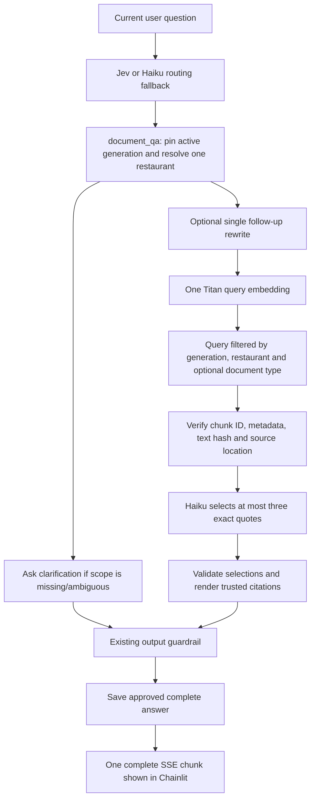

# Document RAG engineering guide

## What this adds

The upstream agent used web/browser tools and conversational memory. This fork adds a separate, controlled document retrieval path. Jev classifies `document_qa` alongside the three existing intents; Haiku remains the routing fallback. Menus and policies live in S3, their Titan V2 embeddings in S3 Vectors. Conversation memory remains separate from the document corpus.

The sample venues are fictional: Harbor Pasta Lab, Sakura Table Lab, and Spice Garden Lab. Six English documents include a text-based PDF. They are engineering fixtures, not real restaurant recommendations.

## Ingestion

```mermaid
flowchart LR
  Catalog[Corpus catalog and source bytes] --> Parse[Bounded PDF/Markdown extraction]
  Parse --> Chunk[Whole records with stable hashes]
  Chunk --> Plan[Offline generation plan]
  Plan --> Cache[Compatible embedding cache]
  Cache --> Titan[Titan V2: 512 normalized floats]
  Titan --> Stage[Stage complete S3 generation and vectors]
  Stage --> Verify[Verify chunks, vectors and filtered query readiness]
  Verify --> Pointer[Conditional active pointer publication]
```



Run from `restaurant-finder-api` after `uv sync --extra local-aws`:

```powershell
uv run python -m src.deployment.ingest_documents --dry-run --corpus sample_documents/corpus.json
uv run python -m src.deployment.ingest_documents --publish --corpus sample_documents/corpus.json --profile default --region us-east-2 --bucket <DocumentBucketName> --index-arn <VectorIndexArn> --max-embedding-attempts 48 --report .generated/rag/initial.json
```

Dry-run constructs no AWS client. Publish is explicit and verifies identity/account/region. A repeated complete active generation creates zero embeddings and writes zero vectors. Cache compatibility covers canonical text, model, dimensions and normalization. Source/version/config changes create a new generation; unchanged text can reuse cached embeddings.

Each document is limited to 5 MiB, 10 PDF pages, and 100,000 extracted characters. A generation has at most six documents and 48 chunks. Records cannot exceed 1,800 characters; overlap retains a complete preceding record of at most 200 characters within the same page or section. Empty/image-only PDFs, unsupported inputs, unsafe paths and oversize records fail explicitly. OCR and complex table reconstruction are outside v1.

All source/chunk/manifest/cache writes are conditional and preserve existing content. The versioned active pointer is published last with the observed ETag (`IfMatch`), or `IfNoneMatch` for first publication. A conflict leaves the staged generation inactive. This provides safe publication across services, not an atomic cross-service transaction. Retained generations support in-flight requests and rollback; nothing is automatically deleted.

Use `sample_documents/corpus-v2.json` for the controlled RM28-to-RM32 Harbor price update. Verify the first price before publishing v2. This fixture changes the complete generation while reusing unchanged text embeddings.

## Question answering

The [document evaluation guide](CI_AND_RAG_EVALUATION.md) describes 17 source-grounded cases, deterministic answer/provenance checks and the credential-free CI workflow. Offline regression reports identify simulated dependencies; they do not claim live model or vector-ranking accuracy.



Examples:

- “According to Harbor Pasta Lab's menu, how much is mushroom pasta?” -> supporting RM28/RM32 quote with page 1, document ID and version.
- “What does Sakura Table Lab's menu say mushroom pasta costs?” -> RM36 from Sakura, regardless of Harbor's similar dish name.
- “And what about its cancellation fee?” -> previous approved document scope, one query rewrite, policy retrieval.
- “According to Harbor's documents, does it offer valet parking?” -> insufficient evidence. Missing policy is not a negative parking claim.
- “What does the uploaded menu say mushroom pasta costs?” -> restaurant clarification, no embedding/vector query.
- “According to Harbor Pasta Lab's policy, what is the cancellation fee?” -> policy-only retrieval; `Pasta` in the restaurant name does not imply a menu request.
- “According to Harbor Pasta Lab's menu and policy, what is the mushroom pasta price and cancellation fee?” -> menu and policy retrieval with separate trusted quotations/citations.

Document-type inference ignores matched catalog-name/alias spans while retaining the full canonical question for embedding and answer selection. Menu-only intent selects `menu`, policy-only intent selects `policy`, and mixed/neutral intent has no type restriction. Existing restaurant clarification, approved follow-up scope and explicit restaurant override remain covered by regression tests. The [query-scoping PRD](HANDOFF_PRD_RAG_QUERY_SCOPE.md) records the code improvement and offline verification. Its selected source `ef146a295fe8edd0c5a9fa50ff5c9eccf70de35e` was deployed on 2026-10-09 as READY Runtime/DEFAULT version 12 through an image-only update; see the [live rollout record](HANDOFF_PRD_RUNTIME_ROLLOUT_AND_LIVE_VALIDATION.md).

The six live scenarios returned the expected menu, policy, mixed, conversational follow-up, insufficient-evidence and clarification behavior. Jev routed every request to `document_qa`; five query embeddings/vector queries, five selections and one follow-up rewrite were observed. Clarification performed no embedding/vector query/selection. Explicit menu and policy citation clicks opened the intended originals; their downloads matched the pinned hashes. A browser download delay prevented the planned immediate follow-up timing, although the same conversation retained Harbor scope. These controlled checks do not establish universal retrieval accuracy, performance or production suitability.

Only server code creates filters and resolves manifest keys. The model selects supplied IDs and exact contiguous quotes; it cannot supply source URLs, restaurant filters or S3 paths. At most five complete passages / 9,000 characters reach the answer selector. Distances are retrieval ordering, not calibrated confidence. Invalid citations, changed quotes, malformed structured answers and instruction-like selections produce a safe failure. No automatic model/graph replay occurs.

Extractive answers intentionally sacrifice conversational paraphrasing for inspectable evidence. Exact matching validates quotation provenance, not universal factual correctness or semantic relevance. Source quality and the answer selector still matter. Retrieved text is treated as untrusted data; the document model has no executable browser, memory or ingestion tools. The normal guardrail can anonymize or block the final cited answer before UI delivery and memory storage.

## Inspecting the original source

New unchanged, approved document answers include optional structured citation references in the same complete SSE chunk. The API resolves them from the selected evidence and pinned manifest; the model still supplies only chunk IDs and exact quotes. Blocked, modified/anonymized, failed and missing-evidence answers carry no clickable references. Pending and approved references reset on every turn.

The local Chainlit server fetches each distinct original once from `rag/generations/<generation>/sources/<document-id>.<pdf-or-md>`, verifies its SHA-256 and 5 MiB size bound, then attaches a clickable `Source 1`/`Source 2`/`Source 3` element. PDFs open at their cited page. Markdown opens as complete literal text with original line numbers and the cited section/range. Original downloads contain the unmodified verified bytes. The loader uses bounded I/O, a 30-second preparation timeout and no SDK or agent retries. Failure preserves the approved answer and plain citation with a source-unavailable notice.

Configure `DOCUMENT_SOURCE_VIEWER_ENABLED=true` and `RAG_DOCUMENT_BUCKET=<DocumentBucketName>` in the UI environment. Its AWS profile needs read access to original objects in the existing private bucket; Runtime's RAG permissions still exclude originals. Source loading makes no extra model or embedding calls. No presigned/public S3 URLs or browser AWS keys are used.

The UI pins Chainlit 2.12.0 for its bundled PDF.js renderer; the earlier iframe viewer displayed a blank PDF in the in-app browser. Chainlit can initially open all new side elements together; clicking a named source selects that element alone. The UI decorates labels as `Source 1 (answer 2)` to make source names distinct across answers. Quotations and document provenance remain unchanged; the API/memory retain the original approved citation text. The UI regression suite covers the distinct labels, and explicit PDF and Markdown clicks were inspected on the final UI.

References pin the full generation and hash, so an older citation cannot silently open the latest source after a corpus update. Existing answers without metadata retain plain citations. Native elements belong to the current Chainlit session; permanent links after a restart/history restore are not provided.

Opening a source discloses the complete controlled fictional document, beyond the quotation checked by the answer guardrail. Markdown is displayed as literal data, with no document HTML/scripts/remote links executed. Keep this anonymous demonstration on loopback. Private documents or public visitors require a separate authentication/authorization design. See the [clickable-citation PRD](HANDOFF_PRD_CLICKABLE_RAG_SOURCES.md) for rollout evidence and criteria.

## Configuration and infrastructure

`DOCUMENT_RAG_ENABLED=false` locally avoids RAG client initialization. For enabled mode set `RAG_DOCUMENT_BUCKET` and `RAG_VECTOR_INDEX_ARN` from `restaurantFinder-RagStack`. Titan V2, 512 dimensions, cosine index distance and normalized float vectors are fixed in v1. Model/dimension changes require a new reviewed index/generation.

The new stack creates a private, versioned, TLS-only ordinary S3 bucket and an S3 vector bucket/index. All are retained on deletion/replacement and use S3-managed encryption. AgentCore depends on this stack and receives exact read permissions for the active pointer, generation manifests/chunks and vector index, plus Titan invocation. Runtime cannot publish/delete corpus data or read embedding caches/original PDFs. Existing unrelated permissions remain unchanged.

The owner's ingestion identity needs `s3:GetObject` and `s3:PutObject` on `rag/*` in the new bucket; `s3vectors:GetIndex`, `GetVectors`, `PutVectors`, `QueryVectors` on the new index; `bedrock:InvokeModel` on `arn:aws:bedrock:us-east-2::foundation-model/amazon.titan-embed-text-v2:0`; and `sts:GetCallerIdentity`. No automatic broad grants or new credentials are created.

Initial rollout: review and deploy RagStack, synchronize/validate all eight prompts, publish a unique ARM64 image, then review and execute the AgentCore-only change set. Supply a specific image URI to CDK. Preserve the existing ECR stack and Lambda/Gateway/Memory/guardrails/tracing configuration. Feature-branch pushes do not trigger the workflows restricted to `main`.

## Rollback and diagnosis

Corpus rollback is explicit and read-validates the retained manifest, chunks, vector set and query readiness before conditional pointer publication:

```powershell
uv run python -m src.deployment.ingest_documents --publish --rollback-generation <previous-generation-hash> --profile default --region us-east-2 --bucket <DocumentBucketName> --index-arn <VectorIndexArn> --report .generated/rag/rollback.json
```

Choose the Runtime rollback boundary for the current rollout. For the query-scoping Runtime-12 release, revert only the image to the captured Runtime-11 citation image, preserving the current RAG environment, role, sources and corpus pointer. Prepare the rollback from a fresh current template and inspect a change set containing only one Runtime image Modify with no replacement. The fresh snapshot is under `.generated/rollout-query-scope-20261009/runtime-rollback.template.json`; verify the baseline digest remains available before use. See the [rollout PRD](HANDOFF_PRD_RUNTIME_ROLLOUT_AND_LIVE_VALIDATION.md) for the reviewed procedure. Rollback does not reverse charges or remove prompt versions.

The earlier initial-RAG rollout saved `.generated/rag/runtime-rollback.template.json`. That historical snapshot restores its pre-RAG image/environment with RAG disabled; it is not the rollback template for Runtime 12. Keep it as phase-specific evidence and use it only for a separately reviewed pre-RAG rollback. No Runtime rollback was performed during either verification phase.

The historical pre-RAG image is `correctness-f9dcf56-20261007135110-arm64`, verified during that phase with digest `sha256:0614966b8424edbeba937ca6f4014d492ccc624d347ecc2ec4f14c35fbcc23c2`. The retained initial corpus generation is `a68dcd7921d2f96d67de441961f55c972ad5af8072eb26f5841f8d7588ef3ab3`. Runtime 12's freshly verified rollback image is `citations-00a846a-20261008052831-arm64`, digest `sha256:7704ff7ce9e906e6508d2128a16b5479b6fb27608e0d05b38bf143c444700761`. Its current active corpus remains generation `29a3a897b651c3d9fe153ce5c819f3acfe29e2ab786ac56d82e998821598267a`.

Safe RAG spans cover scope, embeddings, retrieval, answer selection and validation. They record generation, restaurant IDs, counts/token usage and safe error types; raw queries, passages, embeddings and provider exception payloads are excluded. Enabled but unconfigured/unpublished retrieval returns unavailable. Failure never silently falls back to web search or dining memory.

Offline checks (use an absent manifest path until deployment prompt synchronization):

```powershell
$env:PROMPT_SYNC_MODE='false'
$env:PROMPT_MANIFEST_PATH=(Join-Path (Get-Location) '.generated/offline-no-manifest.json')
$env:REQUIRE_PROMPT_MANIFEST='false'
.venv/Scripts/python.exe -m unittest discover -s tests -q
```

Run UI tests from `restaurant-finder-ui`; run `npm run build`, `npm test -- --runInBand`, and CDK synth from `restaurant-finder-infra`. Deployment/live evidence and unmet acceptance criteria are recorded in `HANDOFF_PRD_DOCUMENT_RAG.md`.
