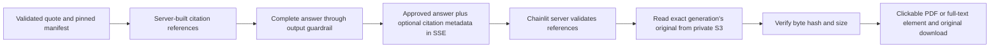

# PRD: Clickable document citations

**Status:** Approved by the owner's explicit `proceed`; implementation and verification complete, feature-branch publication pending.
**Prepared:** 2026-10-08.
**Project:** Restaurant Finder portfolio demo, `origin/feat/jev-router`.

## 1. Outcome and purpose

Make each new, validated document citation clickable in the normal Chainlit chat. A click opens the complete original document version used for that answer, so a viewer can compare the quotation with its surrounding content. Offer a download of the original bytes as well.

This supports the owner's LinkedIn AI engineering demonstration: the audience can inspect retrieval provenance rather than relying only on the generated answer. It is a controlled, local demonstration using fictional restaurant documents.

### Intended experience

For the current Harbor menu, the response will look approximately like:

> "Mushroom Pasta — RM32 ..."
>
> Source: **Source 1** — Harbor Pasta Lab; harbor-menu; page 1; version v2; generation 29a3a897b651

`Source 1` becomes a link to the original PDF in Chainlit's document panel. The viewer opens the cited page. A separately labelled original-file download is available. This is a UX illustration, not a verbatim quotation or verified implementation screenshot.

For a Markdown policy, the link opens the entire original text in a readable panel with source line numbers. Show the cited section and line range clearly and offer the unmodified `.md` download. Any line numbers or location indicators are viewer annotations, not changes to the original file.

## 2. Inspected starting point

The repository was clean at inspection. The recorded deployed RAG baseline is Runtime version 10, with active generation `29a3a897b651c3d9fe153ce5c819f3acfe29e2ab786ac56d82e998821598267a`. Re-read AWS state before deployment; these are baseline records, not a new live inspection.

Relevant existing behavior:

- `src/application/document_rag/workflow.py` validates selected chunk IDs and exact quotations, then renders citations as ordinary text.
- Its pinned generation manifest contains original source references and SHA-256 hashes. Ingestion writes the original bytes at `rag/generations/<generation>/sources/<document-id>.pdf` or `.md`.
- `src/domain/document_rag.py` already validates manifest fingerprints and chunk/source relationships. `RagOutcome` currently has no citation metadata field.
- The output guardrail approves, anonymizes or blocks the complete answer before memory storage and SSE delivery.
- `TurnResult` currently carries only text and a blocked flag. SSE sends one complete `chunk`, followed by `done`; the UI handles direct and nested SSE envelopes.
- `restaurant-finder-ui/app.py` currently renders text without document elements.
- The UI lockfile selects Chainlit **2.9.6**. Its installed `Pdf` class accepts `content`, `display` and `page`. Its `Text` and `File` classes support text inspection and original downloads.
- Chainlit's installed file endpoint resolves files through a live session. The current demo has no application login. This is not a public document authorization design.
- The S3 document bucket is private. Runtime currently reads manifests/chunks, but its RAG IAM policy does not permit reading original source files.
- The previous RAG PRD deliberately excluded raw-source attachments. This PRD proposes the explicit new capability of inspecting the controlled originals after an eligible answer.

### Sources for framework behavior

Chainlit documents [PDF side-panel links and page selection](https://docs.chainlit.io/api-reference/elements/pdf), [text elements](https://docs.chainlit.io/api-reference/elements/text), and [original-file downloads](https://docs.chainlit.io/api-reference/elements/file). Current PDF documentation also describes viewer changes introduced in 2.11.0; do not assume those newer controls exist in the installed 2.9.6 release. Confirm the actual click, page and download behavior in the installed browser UI during implementation.

## 3. Chosen design

Use Chainlit's native document elements, backed by original bytes fetched by the **UI server** from the existing private S3 bucket.



The API constructs references from its validated manifest/evidence. The model continues to select only supplied chunk IDs and quotes. It supplies no URLs, filenames, source keys or viewer instructions.

The UI uses its configured AWS profile to read originals. Keep Runtime's RAG source permissions as they are. Browser clients receive Chainlit session-file references, not AWS credentials or presigned S3 URLs.

### Why this fits the demonstration

- Existing Chainlit elements provide the required viewer without a new custom HTTP document service.
- Exact generation IDs and byte hashes tie a click to the answer's actual source version.
- Short-lived S3 signed URLs would expire and introduce credential-bearing URLs into the response path. Session elements avoid storing those URLs in conversation memory.
- GitHub links to the latest source could open a different document from the one retrieved. Use the stored generation instead.

The readable Markdown panel is a faithful text presentation of the downloaded original, not an LLM summary. The downloadable file must retain the exact bytes whose hash was verified.

## 4. Definition of done

| ID | Observable success criterion |
| --- | --- |
| C1 | A new successful PDF-backed answer has a clickable source label; clicking it visibly opens the complete correct PDF at the cited page in the normal Chainlit UI. |
| C2 | A new successful Markdown-backed answer has a clickable source label; its panel contains the complete source text, source line numbers and cited section/range. |
| C3 | The original-file download has the same SHA-256 hash as the source in the pinned generation manifest. |
| C4 | Updating the active pointer does not redirect an existing citation to newer source bytes. Verify this with retained-generation fixtures without changing the live pointer. |
| C5 | Only validated selections receive clickable references. Unknown IDs, bad hashes, unsafe metadata, unsupported extensions and excessive sizes produce no document element. |
| C6 | Blocked, anonymized/modified, failed and insufficient-evidence answers emit no clickable-source metadata. Per-turn resets prevent old references leaking into later answers. |
| C7 | Source loading failures preserve the approved answer and textual provenance, with a concise source-unavailable notice. They do not replay the graph or invoke an LLM again. |
| C8 | Direct and nested SSE formats both work. Existing clients ignoring the optional metadata still receive the complete answer text. |
| C9 | Source serving remains through the private bucket and local Chainlit session files. No new public bucket, public document URL or broad Runtime grant is introduced. |
| C10 | Targeted offline tests pass; normal browser PDF and Markdown clicks/downloads are inspected; the deployed Runtime and pushed branch are recorded with actual evidence. |

Integrity and provenance help users inspect accuracy. They do not prove the document's claims are true or that every selected quote answers the question correctly.

## 5. Scope and authorization

### Included after sign-off

- Citation contracts and deterministic labels, graph state, output-guardrail gating, SSE transport, UI source loading, native document elements, targeted tests, and documentation.
- UI configuration for the existing RAG bucket; read originals with the owner's current development AWS profile.
- Build/publish one immutable ARM64 image and update the **existing** AgentCore Runtime with reviewed changes.
- Up to **four total live Runtime invocations**, including UI calls and any diagnostic retry, for this feature's verification. The previous RAG allowance was exhausted; this is a separate proposed allowance requiring this PRD's sign-off.
- At most three selected citations and three distinct source downloads per answer. Retrieve each distinct source once for that answer, even if several citations point to it.
- Commit and push the approved changes to `origin/feat/jev-router`, preserving unrelated work.

AWS image storage/build and up to four normal answer requests may incur charges. Source loading performs S3 reads and does not add model calls or embeddings of its own.

### Boundaries

- Keep corpus contents, active generation, vector index, prompts, models, router and ingestion behavior unchanged for this feature.
- No public hosting, application login redesign, document uploads, OCR, corpus republishing, benchmark, main merge or workflow dispatch.
- No new IAM grant without a separately reviewed need. If the UI profile cannot read the exact originals, report the specific missing access and request authorization rather than widening permissions automatically.
- No claim of production readiness or private multi-user document isolation. Start this anonymous demo on loopback; stop if the required viewer behavior would expose sources on a public deployment.
- Source inspection intentionally exposes the entire controlled original. Generated-answer guardrails do not moderate every byte of that file. Do not extend this feature to sensitive/private uploads under the demo assumptions.

## 6. Implementation steps

### Step 1 — Capture the current baseline

Read Git status/branch, current UI process configuration, runtime image/environment, bucket settings and active pointer. Preserve unrelated changes. Record the old image URI/digest and an environment snapshot for rollback without printing secret values.

Use the existing feature branch. Reuse the normal UI at port 8010 where practical; identify its process before restarting it. Do not terminate the separate port-8000 instance.

### Step 2 — Add a bounded citation contract

In `restaurant-finder-api/src/domain/document_rag.py`, add a strict citation model and a default-empty citation list on `RagOutcome`.

Each reference carries a deterministic label, full generation ID, document ID, chunk ID, source SHA-256, source format (`pdf` or `md`), a safe original filename, version, and the existing page or section/line location. Enforce hash/ID patterns, lengths, location bounds and at most three entries.

Do not carry arbitrary URLs, bucket names or caller-provided object keys. The UI bucket is server configuration. A source key is deterministically derived from validated generation/document/format fields.

Keep this metadata out of the model's output schema. `RagAnswerDraft` remains chunk IDs and exact quotes only.

### Step 3 — Render text and references together

In `src/application/document_rag/workflow.py`, construct the textual citation and its reference from the **same** validated selection, evidence and pinned manifest source.

Use stable per-answer labels such as `Source 1`, `Source 2`, `Source 3`. Keep restaurant, document, location, version and generation visible in the textual citation. Sanitize display text and safe filenames.

Verify that evidence and source agree on document, restaurant, version, source hash and generation. Verify the source key equals the expected generation/source path. Fail the document answer safely if its provenance is inconsistent.

Produce no references for clarification, insufficient evidence, disabled, unavailable or invalid-answer outcomes. Preserve the existing exact-quote validation and instruction-like-selection rejection.

### Step 4 — Gate references at output moderation

Add transient pending/approved citation fields to `src/application/orchestrator/workflow/state.py`, and reset both in `src/application/orchestrator/streaming.py` on every turn.

The document node may set pending references. In `workflow/nodes.py`, publish them as approved only when the document answer is allowed **and the final approved text exactly equals the rendered raw answer**. On blocking, anonymization, modification or an exception, clear approved references.

Carry only approved references on `TurnResult`. Keep memory persistence of the approved text as it is; do not persist AWS/session URLs, original bytes or attachments in dining memory. Plain citation labels in history must not recreate attachments automatically.

### Step 5 — Extend SSE compatibly

In `src/infrastructure/streaming.py`, add the optional validated `citations` list to the existing complete-answer chunk event. Prefer one envelope containing both the approved text and its references to avoid partial/mismatched delivery.

Example shape: `{"chunk": "<approved complete answer>", "citations": [<trusted references>]}`. Continue emitting `done`. Block/error events carry no references.

An older UI can ignore this field and still display textual provenance. Do not add another graph run, streaming token path or model call.

### Step 6 — Load and verify originals in the UI server

Add a focused `restaurant-finder-ui/source_documents.py` helper. Add `RAG_DOCUMENT_BUCKET` and an enable/disable setting to `.env.example`, with no credentials committed.

Implement lazy S3 access using the existing region/profile configuration. Use bounded connect/read timeouts, one total SDK attempt, and `asyncio.to_thread` for blocking reads. Bound total source preparation for an answer to 30 seconds; timeout/failure must not trigger an automatic retry or another agent request. Close S3 response bodies.

Validate every reference before reading. Derive only `rag/generations/<64-character-id>/sources/<safe-document-id>.<pdf-or-md>` in the configured bucket. Do not follow the active pointer or use arbitrary filesystem/HTTP paths.

Check declared length and actually read at most 5 MiB plus one byte. Reject empty/oversize payloads. Compare SHA-256 of the original bytes to the approved reference before creating any element. Require a valid PDF signature for PDF sources and strict UTF-8 for Markdown.

Deduplicate source reads within the answer. Avoid a global corpus cache in v1. Do not log source bodies, signed URLs, credentials or raw provider exception messages. Keep Chainlit's generated `.files` data ignored by Git.

### Step 7 — Create native clickable elements

In `restaurant-finder-ui/app.py`, validate/collect the optional metadata from direct and nested SSE responses. Attach elements only to the matching successful final message.

- For PDF: create `cl.Pdf(name=<citation label>, content=<verified original bytes>, display="side", page=<cited page>)`.
- For Markdown: create `cl.Text` with a safe full-text presentation and line numbers. Clearly show the cited section/range. Use escaped literal text or a collision-safe code block; never execute/render document HTML, scripts or embedded remote images/links.
- Offer `cl.File` downloads of the original verified bytes, using a safe filename and a MIME type that does not execute Markdown/HTML. Do not alter the downloadable source to add line numbers.

The element name must appear in the approved message text for the native source link. Attach/update through the message API and verify that behavior in installed Chainlit 2.9.6.

Do not replace answer text with a source-loader exception. A source failure should leave its citation as plain text and add a short UI notice such as "The source document is temporarily unavailable." Keep all elements absent on blocked/error events.

If the installed PDF viewer cannot honor page selection, record that validation gap and fix within the existing framework capabilities. Do not silently upgrade Chainlit or claim C1 is complete without inspecting the actual viewer.

### Step 8 — Add and run targeted offline verification

Approval of this PRD authorizes these tests. Until approval, do not add or run them.

Extend API RAG/moderation/SSE tests for:

- Server-built citations exactly matching validated manifest sources and quotes.
- Three-reference bound, distinct locations and deterministic labels.
- Forged IDs, wrong generation/hash/key and extra fields rejected.
- Blocked/anonymized output and subsequent turns emitting no stale references.
- Non-RAG and missing-evidence turns retaining existing behavior.
- Approved complete text and optional metadata delivered once; memory stores approved text.

Extend UI tests and add source-loader unit tests for:

- Direct/nested SSE transport and backward compatibility without metadata.
- Correct PDF page and safe complete Markdown presentation/download.
- Correct byte hashes; bad hash/format/encoding, unsafe IDs, oversize bodies, missing settings, denied reads and timeouts failing safely.
- One read per distinct source, body closure and blocking work off the event loop.
- References to the retained v1 generation reading v1 bytes even when a fake active pointer changes to v2.
- HTML, backticks, Markdown links and image syntax appearing as source text without active content.

Run relevant API and UI regression suites. Record exact commands/counts/results. No retrieval benchmark or live corpus mutation is needed.

### Step 9 — Deploy the API and configure the demo UI

Before AWS mutation, inspect identity and current Runtime/CloudFormation state. Stop on unexpected drift or a change set that replaces resources or modifies unrelated permissions/services.

Build a uniquely tagged ARM64 image using the existing workflow. Preserve the synchronized prompt manifest. Publish to the existing ECR repository and record source commit, tag and digest.

Prepare and inspect an existing-AgentCore update change set. It should update the Runtime image only as required for the new citation envelope. Preserve environment, source IAM restrictions, vector stack, Lambda, Gateway, Memory and guardrails. Execute within this approved scope, then verify readiness and actual image.

Configure the local UI with the existing private document bucket and region. Read-check one retained original using its exact key/hash; do not grant new access implicitly. Restart only the identified demo UI process when necessary, bind to loopback and verify port 8010.

### Step 10 — Inspect the normal browser experience

Use a fresh synthetic demo conversation. Count all live Runtime invocations against the four-call maximum, including browser sends and retries.

1. Ask a straightforward Harbor menu price question. Inspect the approved answer, click its source label, verify page 1 and RM32 in the complete v2 PDF, then verify downloaded-byte hash.
2. Ask a straightforward policy question. Click its Markdown source, inspect the complete document and cited line range, then verify its unmodified download.
3. Use offline fixtures to verify the retained v1 source/updated-pointer scenario and blocked/failure cases. Do not spend live calls or switch the active pointer for these checks.
4. Save minimal non-sensitive screenshots and a verification record. Mark any criterion not observed as unverified.

If a live call fails, diagnose with offline tests/read-only logs before using a spare. Stop at four attempts and report the gap rather than extending the allowance silently.

### Step 11 — Document, commit and push

Update `docs/DOCUMENT_RAG.md` and the relevant README/config examples to describe the click flow, exact-generation guarantee, UI read access, full-original disclosure, session lifetime and limits.

Record the actual implementation files, test results, deployment evidence and C1-C10 status in this PRD. Review the diff for credentials, original downloaded bytes, `.files`, generated reports and unrelated changes. Commit and push to the existing feature branch; verify the remote commit. No PR creation or main merge is included.

## 7. Lifetime, failure and compatibility rules

- Native document elements are associated with the current Chainlit message/session. Do not promise permanent links across server restarts or historical-chat restoration without a persistence feature.
- Answers created before this metadata change keep their textual citations. New eligible answers receive inspectable originals. Do not infer source access by parsing arbitrary old or model-written citation text.
- If a retained original is unavailable, report that condition. Never substitute the current source version, repository checkout or an extracted chunk.
- Source access errors affect source inspection; the already-approved answer remains visible.
- The UI validates references from its configured backend. Browser-supplied source IDs or file uploads are not inputs to this loader.
- The controlled corpus consists of fictional demo documents. Using this flow with private documents/public visitors requires a separate authentication and per-document authorization design.

## 8. Rollback

The UI feature flag can disable source fetching/elements while retaining the text response. The optional SSE field is backward compatible with the existing UI.

If deployment rollback is required, restore the captured previous Runtime image via a reviewed Runtime-only change set. Do not roll back/delete the RAG stack or republish the active pointer. Restore the prior UI commit/config and restart only the demo process. Image publication and incurred charges are not undone.

## 9. Assumptions and approval gate

Assumptions: the user wants an in-app document panel with original download; the local UI server uses the owner's AWS development profile; the source corpus remains the existing fictional controlled documents; historical permanent links and public hosting are outside this request.

The owner supplied the required explicit **proceed** for local implementation, targeted verification, the bounded existing-Runtime deployment and feature-branch push described above. No further product-choice question blocked execution.

No application code, AWS resources or tests were changed/run while preparing this proposal.

### Implementation adjustment: PDF renderer

The first live browser check opened a valid hash-verified original PDF, but Chainlit 2.9.6's iframe viewer remained blank in Codex's in-app browser. The original download was available. This prevents criterion C1 from being complete. The issue and the UI dependency update were explained to the owner during execution.

Use the supported native PDF.js viewer supplied by Chainlit 2.12.0, pinned in the UI dependency/lockfile, and rerun the UI regression tests and browser check. The official [PDF documentation](https://docs.chainlit.io/api-reference/elements/pdf) identifies the renderer introduced in 2.11.0; the [release history](https://github.com/Chainlit/chainlit/releases) was inspected before selecting 2.12.0. This is a necessary UI compatibility correction within the approved citation feature. It requires no further Runtime image, corpus update or access grant. Count the repeat PDF question against the existing four-call allowance.

### Implementation adjustment: distinct viewer names

Initial browser inspection showed the PDF and policy together in one panel. Inspection of the installed frontend established that Chainlit automatically opens all new side elements together; clicking a named source selects that element alone. Repeated names also make native link selection ambiguous across answers. The UI now decorates eligible navigation labels with a per-session answer number, for example `Source 1 (answer 2)`. Native element names use the same distinct label. The API's approved text, quotations, citation metadata and memory text retain their existing format; only the UI navigation label is decorated after its reference and original bytes are validated. Failed source loads keep their plain textual labels.

An offline regression checks distinct names across answers. The fourth and last allowed live check combined the menu and cancellation questions. Explicitly clicking each final source link opened only its correct document.

## 10. Execution record

### Steps completed

1. Captured the clean branch at `1375b93fc6d40eef7b017ade78f0d541af228605`, Runtime version 10, image/environment, CloudFormation template, private-bucket settings and active generation. Retained rollback records locally.
2. Added the strict API citation contract and bounded `RagOutcome.citations` field.
3. Built references and textual citations together from verified selections and the pinned manifest. Kept references outside the model's answer schema.
4. Added pending/approved per-turn state, exact unchanged-answer moderation gating and citation-bearing `TurnResult`. Memory continues to receive the approved API text.
5. Added optional approved references to the same complete SSE chunk; preserved the existing `done` event and legacy-client text behavior.
6. Added the UI's strict validation, generation-derived S3 reads, size/hash checks, bounded asynchronous loading, source deduplication and safe failures.
7. Added PDF/full-text source panels and unmodified file downloads. Corrected the PDF renderer and distinct navigation names as documented above.
8. Ran the final API and UI offline suites: **105 API tests passed** and **26 UI tests passed**. Logs from deliberately failing fixtures are expected. Validated the existing eight deployment prompt versions without creating new versions.
9. Published one ARM64 API image, reviewed and executed the existing stack's Runtime-only change set, and configured/restarted only the local port-8010 demo. Kept the unrelated port-8000 process running.
10. Used **four of four authorized Runtime calls**. The final combined answer and both explicit source clicks passed; both original downloads matched their pinned hashes. No Runtime calls remain in this allowance.
11. Updated documentation/config examples and reviewed the tracked diff. Final feature-branch publication is recorded below after Git verification.

### Final offline commands

From `restaurant-finder-api`:

```powershell
$env:PROMPT_SYNC_MODE='false'
$env:PROMPT_MANIFEST_PATH='.generated/offline-no-manifest.json'
$env:REQUIRE_PROMPT_MANIFEST='false'
$env:LOGURU_LEVEL='ERROR'
.venv/Scripts/python.exe -m unittest discover -s tests -q
```

Result: **105 tests, OK**. From `restaurant-finder-ui`:

```powershell
.venv/Scripts/python.exe -m unittest discover -s tests -q
```

Result: **26 tests, OK**, including direct/nested SSE, unchanged-answer attachment gating, safe source failures and distinct viewer names. MCP remains disabled; Chainlit's notice about ignored older MCP config sections does not affect the document feature.

The UI dependency update encountered a Windows lock on `.venv/Scripts/chainlit.exe` held by the separate port-8000 application. That process was preserved. Chainlit package metadata and bundled PDF worker verified version 2.12.0; `uv sync --locked --extra local-aws --no-install-package chainlit --inexact` completed the supporting dependencies. The demo runs with `.venv/Scripts/python.exe -m chainlit run app.py --host 127.0.0.1 --port 8010 --headless`, which uses the updated package without replacing the locked launcher. A full launcher replacement can be completed after the owner stops that other application; it is not needed by the current demo.

### Deployment evidence

- Region: `us-east-2`; existing Runtime: `restaurantFinder_Agent-Ha58oX5Psu`.
- Final read-only check: Runtime **READY**, version **11**; `restaurantFinder-AgentCoreStack` **UPDATE_COMPLETE**.
- API image source commit: `00a846a44d5ecac3ffc458d0331470fc9d16393d`.
- Image: `447393541969.dkr.ecr.us-east-2.amazonaws.com/restaurantfinder-agent:citations-00a846a-20261008052831-arm64`.
- Digest: `sha256:7704ff7ce9e906e6508d2128a16b5479b6fb27608e0d05b38bf143c444700761`; build descriptor confirms `linux/arm64`.
- Reviewed change set: exactly one `Modify` for `restaurantFinderAgentCoreRuntime`, replacement `False`, changing only `AgentRuntimeArtifact`. No IAM/resource replacement was included.
- Runtime environment, Runtime role and CloudFormation execution role match the captured baseline. All four bucket public-access blocks remained enabled at source preflight.
- Active generation remained `29a3a897b651c3d9fe153ce5c819f3acfe29e2ab786ac56d82e998821598267a`; the final pointer content equals the captured baseline.
- Citation rollback image: `document-rag-47a7ddb-20261008040245-arm64`, digest `sha256:70bb7c82728901c6a02dc6b7c4f88caf74ba7855b494694aec5dd9228021f009`. The ignored `.generated/citations/runtime-rollback.template.json` restores this image through a separately reviewed Runtime-only update. No rollback was performed.
- Final UI renderer/name fixes change only the local UI and documentation; no second API image or Runtime update was required.

### Browser and original-file evidence

The final live question was: "According to Harbor Pasta Lab's menu and policy, how much is mushroom pasta and what is the cancellation fee?"

- Menu: exact quote `Mushroom pasta - RM32 per serving.`; `Source 1 (answer 1)` opens the complete Harbor menu v2 PDF at page **1 of 1**. The visible PDF includes RM32 and its surrounding menu entries.
- Policy: exact quote `Cancellations less than 24 hours before the booking incur a RM20 fee per booking.`; `Source 2 (answer 1)` opens only the complete 11-line policy, including cited section **Reservations and cancellation**, lines **5–8**. The UI adds line numbers; the download retains original bytes.
- Downloaded both files through the final message's observed Chainlit session-file endpoints, independently of the S3 preflight. Menu: **1,975 bytes**, SHA-256 `501c1300d00c571e8f94920a6ab25bd0a4ae54976e79ed047bce8e9dc8f6bb10`; policy: **534 bytes**, SHA-256 `d3d4b1ca9ca945c0f0db133c50bf02ae8c75c8736b32232a902634a8faa79471`. Both match the pinned manifest.
- A prior actual browser menu download also matched that PDF hash. Final screenshots are saved locally as `.generated/citations/ui-pdf.png` and `ui-policy.png`.
- Retained v1 menu read-check: generation `a68dcd7921d2f96d67de441961f55c972ad5af8072eb26f5841f8d7588ef3ab3`, **1,973 bytes**, SHA-256 `70ee04a2490bf03df5da3e0d15efeaf7b29b38cd3075c5b44872b1d6cf547ea2`. The offline source-key test confirms pointer changes do not change a pinned source lookup. The live active pointer was never modified for this feature.

Private AWS snapshots, downloaded originals, browser session URLs and generated reports remain ignored under `restaurant-finder-api/.generated/citations/`; Chainlit session files and `.env` remain ignored. None are Git deliverables or included in the API image.

### Acceptance results

| ID | Result and evidence |
| --- | --- |
| C1 | Passed: final explicit PDF source click shows menu v2, page 1/1 and RM32 using the native PDF.js viewer. |
| C2 | Passed: final explicit policy source click shows the complete numbered document and cited section/range. |
| C3 | Passed: both final session-served original downloads match their manifest hashes and lengths. |
| C4 | Passed through retained-source read-check and offline pointer-change fixture; no live pointer mutation. |
| C5 | Passed offline: strict IDs/hashes/metadata, evidence/manifest agreement, format/encoding and size bounds. |
| C6 | Passed offline: blocked/modified/error/no-evidence paths exclude metadata, and per-turn state resets prevent stale references. |
| C7 | Passed offline: source failures/timeouts preserve approved text and never replay the agent; duplicate failures are not retried. |
| C8 | Passed offline: direct/nested SSE and responses without citation metadata retain compatible text behavior. |
| C9 | Passed by inspected change set, private-bucket read checks and local session serving; no new grants or public URLs. |
| C10 | Tests, browser evidence and deployment passed; feature-branch publication pending the final push verification. |

Verification limits: live inspection covered the current fictional one-page menu and Markdown policy. Other PDFs/page locations and failure/moderation paths were exercised with offline fixtures, not additional live calls. This is session-scoped source inspection on a local anonymous demo; permanent historical links and public/private multi-user authorization remain outside scope.

### Git publication

The implementation commit is `00a846a44d5ecac3ffc458d0331470fc9d16393d`. Final UI fixes and this execution record will be committed and pushed to the existing `origin/feat/jev-router`; record the verified remote implementation commit after publication. No PR, main merge or workflow dispatch is part of this task.
